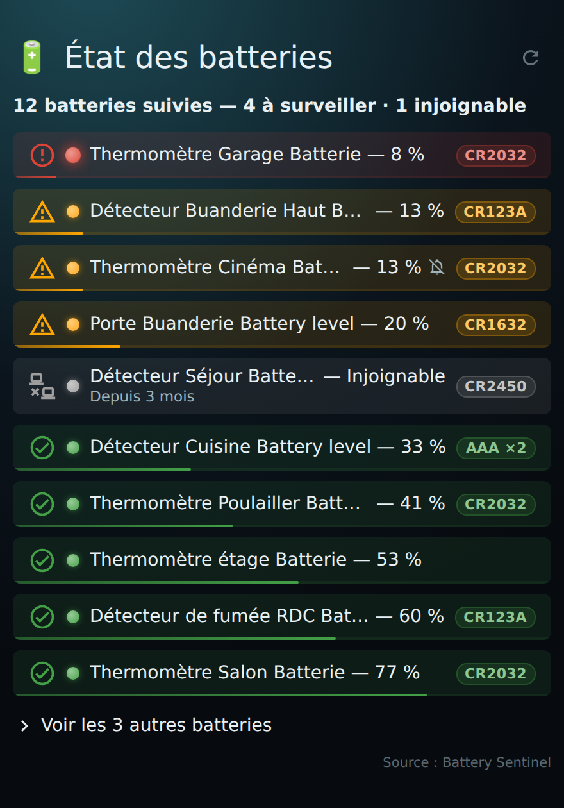
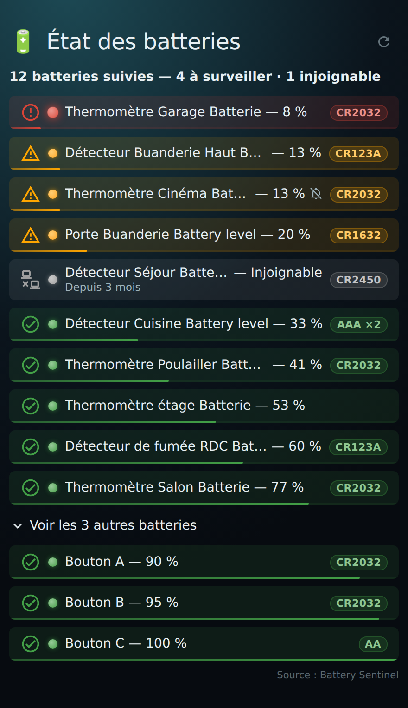

# 🔋 HOLM Sentinel Card

[](https://hacs.xyz/)


**Toutes les piles de la maison en un coup d'œil : celles à changer en rouge, celles à surveiller en orange, le reste en vert.**

HOLM Sentinel Card affiche l'état de toutes vos batteries dans une carte claire et animée, alimentée par l'add-on **[Battery Sentinel Plus](https://github.com/smcneece/battery-sentinel)**. Elle reprend ses réglages (seuils par appareil, type de pile, dernier remplacement, appareils ignorés ou en pause) et affiche les niveaux **en direct**. Un toucher sur une ligne ouvre directement **la page de l'appareil** concerné.

> ✨ **Zéro YAML.** On ajoute la carte depuis le sélecteur de cartes : elle trouve Sentinel toute seule, et tous ses réglages se font dans l'éditeur visuel.

### En bref

- 🚦 **Lisible immédiatement** : lignes rouges (à changer), orange (à surveiller), vertes (OK) et grises (appareil injoignable), triées de la plus urgente à la plus pleine.
- 📊 **Résumé** : « 47 batteries suivies — 6 à surveiller · 2 injoignables ».
- 🔋 **Infos de Sentinel** : type de pile (CR2032, AAA ×2…), seuil d'alerte propre à chaque appareil, date du dernier remplacement, appareils en pause 🔕, appareils ignorés masqués.
- 📡 **Injoignables** : les appareils qui ne répondent plus apparaissent avec depuis quand.
- 👆 **Cliquable** : un toucher ouvre la page de l'appareil dans Home Assistant.
- 🎞️ **Animée** : apparition en cascade, jauge qui se remplit sous chaque ligne, alerte rouge qui pulse, liste « Voir les autres batteries » qui se déplie.
- ⚡ **En direct** : niveaux mis à jour en temps réel, réglages de Sentinel relus toutes les 5 minutes (bouton ↻ pour forcer).
- 🛟 **Toujours utile** : sans Sentinel, la carte affiche les batteries de Home Assistant.

| Aperçu | Liste dépliée |
|---|---|
|  |  |

---

## Prérequis

> [!IMPORTANT]
> Pour profiter des infos de Sentinel (seuils, type de pile, remplacement, injoignables), il faut :
> - **Home Assistant OS ou Supervised** (les add-ons nécessitent le Supervisor) ;
> - l'add-on **[Battery Sentinel Plus](https://github.com/smcneece/battery-sentinel)** installé et **démarré**.
>
> Sans Sentinel, la carte fonctionne quand même avec toutes les entités « batterie » de Home Assistant, sans ces informations supplémentaires.

La carte lit les données de Sentinel **via Home Assistant** (l'accès intégré de l'add-on) : rien à ouvrir sur le réseau, aucune adresse ni clé à saisir, et ça fonctionne en HTTPS comme depuis l'extérieur.

---

## Installation

### Avec HACS (recommandé)

1. HACS → menu ⋮ → **Dépôts personnalisés**.
2. Ajoutez `https://github.com/kaaribou/holm-sentinel-card`, catégorie **Tableau de bord** (*Dashboard / Plugin*).
3. Recherchez **HOLM Sentinel Card** → **Télécharger**.
4. Rechargez la page (Ctrl + F5).

### Manuellement

1. Copiez `dist/holm-sentinel-card.js` dans `config/www/community/holm-sentinel-card/`.
2. **Paramètres → Tableaux de bord → ⋮ → Ressources → Ajouter** : `/local/community/holm-sentinel-card/holm-sentinel-card.js`, type **Module JavaScript**.
3. Rechargez la page.

---

## Utilisation

Ajoutez la carte **HOLM Batteries (Sentinel)** depuis le sélecteur de cartes. C'est tout.

```yaml
type: custom:holm-sentinel-card
```

### Couleurs et seuils

| Ligne | Quand |
|---|---|
| 🔴 Rouge | niveau sous le **seuil rouge** (Sentinel : 10 % par défaut) |
| 🟠 Orange | niveau sous le **seuil orange** (Sentinel : 25 % par défaut) **ou** sous le seuil d'alerte réglé pour cet appareil dans Sentinel |
| ⚪ Gris | appareil injoignable (indisponible ou inconnu) |
| 🟢 Vert | tout va bien |

Les seuils suivent les réglages de couleurs de Sentinel ; vous pouvez les remplacer dans la carte.

---

## Options

| Option | Description | Par défaut |
|---|---|---|
| `title` / `emoji` | Titre et émoji | `État des batteries` / 🔋 |
| `max_items` | Batteries affichées avant « Voir les autres » | `10` |
| `show_type` | Étiquette du type de pile | `true` |
| `show_bar` | Jauge animée sous chaque ligne | `true` |
| `show_area` | Pièce de l'appareil | `false` |
| `show_replaced` | Date du dernier remplacement | `false` |
| `show_unavailable` | Appareils injoignables | `true` |
| `show_ok` | Batteries en bon état | `true` |
| `hide_ignored` | Masquer les appareils réglés sur « Ignorer » dans Sentinel | `true` |
| `hide_browser` | Masquer les batteries de navigateurs (Browser Mod) | `true` |
| `red_threshold` / `yellow_threshold` | Seuils personnalisés (%) | ceux de Sentinel |
| `exclude` | Entités à ne jamais afficher | — |
| `addon` | Identifiant de l'add-on si différent | détection automatique |

```yaml
type: custom:holm-sentinel-card
title: Piles à surveiller
max_items: 8
show_area: true
show_replaced: true
show_ok: false
exclude:
  - sensor.telephone_battery_level
```

---

## FAQ / dépannage

| Problème | Solution |
|---|---|
| « Source : Home Assistant » au lieu de « Battery Sentinel » | L'add-on n'est pas démarré ou n'est pas installé. Démarrez-le puis touchez ↻. |
| Un appareil n'apparaît pas | Il est peut-être masqué ou réglé sur « Ignorer » dans Sentinel, exclu dans la carte, ou c'est une batterie de navigateur (option `hide_browser`). |
| Le toucher n'ouvre pas la page de l'appareil | La page des appareils fait partie des paramètres de Home Assistant : elle est réservée aux comptes administrateurs. |
| Téléphones et tablettes dans la liste | Ajoutez-les à `exclude`, ou réglez-les sur « Ignorer » dans Sentinel. |
| La nouvelle version ne s'affiche pas | Videz le cache (Ctrl + F5, ou « Recharger les ressources » dans l'application mobile). |

---

## Un petit merci ?

La carte vous plaît ? Vous pouvez m'offrir une bière 🍺

[](https://paypal.me/kaaribou)

---

## Crédits & licence

- Données : **[Battery Sentinel Plus](https://github.com/smcneece/battery-sentinel)** de smcneece, un projet indépendant (cette carte n'y est pas affiliée).
- Code : licence **MIT** — © kaaribou. Voir le [CHANGELOG](CHANGELOG.md).

Fait partie de la collection **HOLM** : [HOLM Navbar Card](https://github.com/kaaribou/holm-navbar-card) · [HOLM Music Card](https://github.com/kaaribou/holm-music-card) · [Carburant HOLM](https://github.com/kaaribou/carburant-holm).
